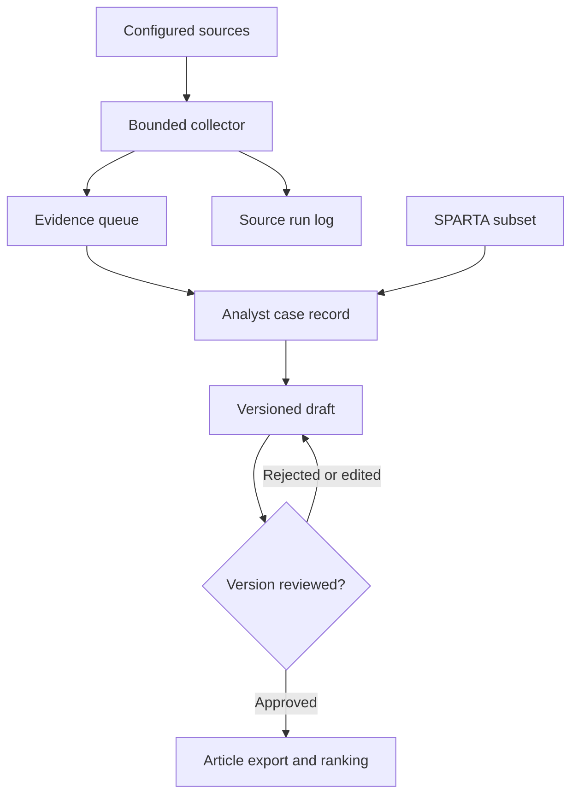

# Architecture

## Runtime

Python standard library + SQLite + a server-rendered, read-only local dashboard.
The runtime deliberately avoids framework installation during the first learning
session. Its HTTP server is for a single-user loopback workspace, not internet
hosting. A later public deployment should use a supported production web server,
authentication, TLS, request limits and separate worker identity.

Collection does not create asserted incident facts. The analyst uses source leads
to author structured JSON records. Article generation is deterministic: it renders
that record, preserving certainty labels and source IDs. Downloading a draft is
allowed, but its draft status is visible. `article --approved-only` is the export
gate for a later publishing integration. No public publishing integration exists
in this milestone.

## Data

| Table | Purpose |
| --- | --- |
| incidents | Current record, content hash, version and review status |
| revisions | Prior case payloads and hashes |
| reviews | Who approved/rejected which version, when, and why |
| candidates | Source URL, title, excerpt, publication/discovery/change dates |
| candidate_sources | Source associations for duplicate URLs |
| runs | Per-source start/end, outcome, counts, source hash and error |

Hashes detect changes; they are not digital signatures or proof of authorship.
The audit history is application-maintained, not tamper-proof against a person
with write access to the database. SQLite transactions protect record transitions.

URL normalization removes fragments and common tracking parameters. Different
URLs about the same incident remain separate leads; v0.1 does not claim semantic
deduplication. A shared URL reported by two feeds has two provenance associations.
Titles/excerpts from a later source may replace prior candidate metadata. The
candidate queue is not a forensic archive of every full article revision.

## Daily operation

`daily` collects configured sources, then writes a dated briefing. Partial source
failure still produces a briefing with errors visible and returns nonzero.
`worker` runs it once at startup and again 24 hours after each completed run. The
worker must remain running. A restart performs another idempotent collection;
there is no backfill of every missed day and no guarantee of an exact clock time.
Use one worker per database. A proper wall-clock scheduler is a later extension.

Starting collection contacts the configured sources. Starting only the dashboard
does not. Docker's `daily` profile is opt-in and is not enabled by the base command.

## Priority

Mission impact, affected scope and recovery difficulty are analyst-assigned
ordinal values, each 0–5. Their sum is a transparent local editorial priority, not
a calibrated probability, financial-loss model, CVSS score or global ranking.
Ties use the record ID for deterministic ordering. Draft, rejected, research and
hypothetical records never enter the approved-incident top five.

## Planned extension points

1. Full versioned SPARTA importer with provenance, deprecation handling and
   migration tests; require reassessment when a definition changes.
2. More permitted operator, government, vendor and research feeds; measure recall
   against a curated benchmark before claiming broad coverage.
3. Optional LLM extraction returning **draft** claims with exact evidence spans.
   Treat retrieved material as untrusted data; no tool use or publication rights.
4. Analyst editor with authentication and CSRF protection; preserve version checks.
5. Staging deployment, signed artifacts, release approvals and rollback.

These are future milestones, not completed features.
